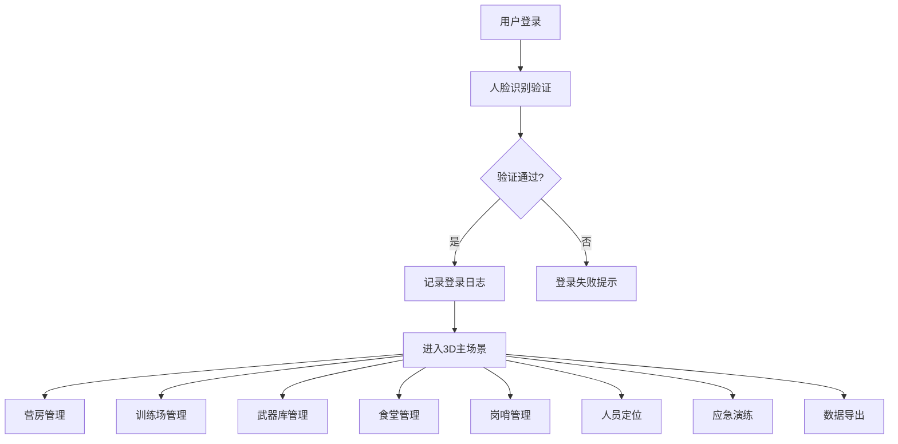

## 1. 产品概述

3D智慧军营综合管理与应急调度可视化平台是一个基于WebGL的三维可视化军营管理系统，通过3D场景直观展示营区各类设施状态、人员位置及实时数据，实现营房管理、训练调度、武器监管、后勤保障、安全警戒和应急指挥的一体化智能管理。

- **主要目的**：提升军营管理效率，实现可视化、智能化、一体化的营区综合管理与应急调度
- **解决问题**：传统军营管理信息分散、响应滞后、缺乏直观可视化手段的痛点
- **目标用户**：班长、连长、营长、旅长四级军事管理人员
- **产品价值**：通过3D可视化技术实现营区状态全感知、应急响应全流程、数据统计全维度

## 2. 核心 Features

### 2.1 用户角色

| 角色 | 登录方式 | 核心权限 |
|------|----------|----------|
| 班长 | 人脸识别 | 查看所属班组人员信息、营房状态、训练安排 |
| 连长 | 人脸识别 | 查看全连数据、审批岗哨换岗、查看训练成绩 |
| 营长 | 人脸识别 | 查看全营数据、审批武器保养工单、启动应急演练 |
| 旅长 | 人脸识别 | 查看全旅数据、审批采购申请、系统管理权限 |

### 2.2 Feature Module

1. **登录页**：人脸识别登录、权限验证、操作日志记录
2. **3D主场景**：营区全景展示、建筑模型交互、人员定位可视化
3. **营房管理模块**：房间信息展示、入住官兵详情、床铺占用率统计
4. **训练场管理模块**：训练科目展示、参训人数统计、场地占用率监控、智能排课
5. **武器库管理模块**：武器柜状态、武器信息、保养提醒、工单生成
6. **食堂管理模块**：窗口排队人数、菜品库存、采购申请三级审批
7. **岗哨管理模块**：哨兵信息、当班时长、换岗提醒
8. **人员定位模块**：实时位置追踪、禁区闯入警报
9. **应急调度模块**：一键演练、疏散路径展示、警戒区标注、通知推送
10. **数据导出模块**：综合日报Excel导出、数据统计分析

### 2.3 Page Details

| 页面名称 | 模块名称 | 功能描述 |
|----------|----------|----------|
| 登录页 | 人脸识别登录 | 摄像头采集人脸、身份验证、权限分配、登录日志记录 |
| 主场景页 | 3D营区场景 | 可旋转缩放3D场景、6类建筑模型、人员模型实时显示 |
| 主场景页 | 营房信息面板 | 显示房间编号、入住官兵、床铺占用率，点击查看人员档案和训练成绩 |
| 主场景页 | 训练场信息面板 | 显示训练科目、参训人数、场地占用率，超80%变红并自动调课 |
| 主场景页 | 武器库信息面板 | 显示武器类型、数量、保养日期，不足7天橙色闪烁并生成工单 |
| 主场景页 | 食堂信息面板 | 显示排队人数、菜品库存，低于阈值生成采购申请 |
| 主场景页 | 岗哨信息面板 | 显示哨兵姓名、当班时长，超2小时提示换岗 |
| 主场景页 | 人员定位显示 | 官兵头顶显示姓名，进入禁区模型变红并推送警报 |
| 主场景页 | 应急演练控制 | 一键启动演练，显示绿色疏散路径和红色警戒区 |
| 审批面板 | 采购审批流程 | 司务长-后勤处长-政委三级审批流程 |
| 数据导出页 | Excel导出 | 按日期导出综合日报，含各类统计数据 |

## 3. 核心流程

### 3.1 登录流程
用户打开系统 → 启动摄像头进行人脸识别 → 系统验证身份并匹配权限 → 记录登录日志 → 进入对应权限的3D主场景

### 3.2 日常监控流程
进入3D场景 → 浏览各建筑模型状态 → 查看实时数据（营房/训练场/武器库/食堂/岗哨） → 处理预警信息（保养提醒/换岗提醒/库存预警） → 查看人员定位和禁区警报

### 3.3 应急演练流程
点击一键演练按钮 → 系统模拟营区遇袭场景 → 自动生成绿色疏散路径和红色警戒区 → 推送警报通知到所有终端 → 指挥人员调度 → 演练结束生成报告

### 3.4 采购审批流程
菜品库存低于阈值 → 自动生成采购申请 → 司务长审批 → 后勤处长审批 → 政委审批 → 审批通过进入采购流程

### 3.5 数据导出流程
选择日期范围 → 点击导出Excel → 系统生成综合日报（营房入住率/训练场使用/武器保养/岗哨统计） → 下载Excel文件

## 4. 用户界面设计

### 4.1 设计风格
- **主色调**：军绿色(#2C5F2D)、深蓝色(#1E3A5F)作为主色，体现军事专业感
- **辅助色**：警戒红(#D62828)、预警橙(#F77F00)、安全绿(#00A86B)、信息蓝(#0077B6)
- **背景色**：深灰(#1A1A2E)、深蓝黑(#0F0F1A)，营造科技感和沉浸感
- **按钮风格**：3D立体按钮，军绿色边框，悬停时有发光效果
- **字体**：标题使用"Orbitron"科技感字体，正文使用"Noto Sans SC"清晰易读
- **布局风格**：左侧导航栏 + 中央3D场景 + 右侧信息面板 + 底部状态栏
- **图标风格**：线性军事风格图标，配合发光效果

### 4.2 页面设计概述

| 页面名称 | 模块名称 | UI元素 |
|----------|----------|--------|
| 登录页 | 人脸识别区域 | 圆形摄像头取景框、扫描动画、军人背景、登录按钮 |
| 登录页 | 信息展示区 | 系统名称、版本信息、安全提示 |
| 主场景页 | 顶部导航栏 | 系统Logo、用户信息、当前时间、消息通知、退出按钮 |
| 主场景页 | 左侧功能栏 | 各模块快捷入口图标、选中高亮、悬停展开 |
| 主场景页 | 中央3D场景 | 可交互3D模型、标签标注、高亮提示、动画效果 |
| 主场景页 | 右侧信息面板 | 建筑详情、数据图表、实时数据、预警列表 |
| 主场景页 | 底部状态栏 | 系统状态、在线人数、预警数量、快捷操作 |
| 审批面板 | 审批流程 | 步骤指示器、申请详情、审批按钮、意见输入 |
| 数据导出页 | 导出配置 | 日期选择器、数据类型勾选、导出预览、下载按钮 |

### 4.3 响应性
- **桌面优先**：针对1920×1080及以上分辨率优化
- **自适应**：支持1280×720到2560×1440分辨率自适应
- **触控优化**：支持平板设备触控操作，3D场景手势缩放旋转

### 4.4 3D场景设计
- **环境/HDRI**：军营日间场景，明亮清晰的光照，真实感天空盒
- **光照设置**：主方向光模拟太阳光，环境光补充，各建筑内部点光源
- **相机设置**：默认俯视45度角，支持OrbitControls旋转缩放，限制角度避免穿模
- **构图**：指挥中心居中，营房、训练场、武器库、食堂、岗哨环绕分布
- **交互**：鼠标悬停模型高亮，点击弹出详情面板，双击聚焦建筑
- **动画**：人员行走动画、旗帜飘动、训练场景动态效果、预警闪烁
- **后处理**：Bloom发光效果、轻微抗锯齿，提升视觉质感
- **性能**：模型使用低多边形，实例化渲染，目标帧率60fps
