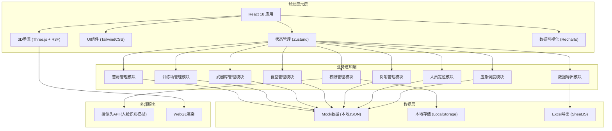
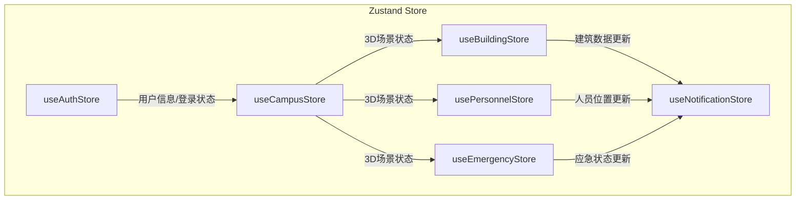

## 1. 架构设计



## 2. 技术描述

- **前端框架**: React 18 + TypeScript
- **构建工具**: Vite 5
- **样式方案**: TailwindCSS 3
- **3D渲染**: Three.js + @react-three/fiber + @react-three/drei + @react-three/postprocessing
- **状态管理**: Zustand
- **图表库**: Recharts
- **Excel导出**: xlsx (SheetJS)
- **路由**: React Router DOM 6
- **图标**: Lucide React
- **动画**: Framer Motion
- **后端**: 无后端，使用Mock数据模拟
- **数据存储**: LocalStorage存储用户信息和操作日志

## 3. 路由定义

| 路由 | 用途 |
|------|------|
| /login | 登录页面，人脸识别登录 |
| /dashboard | 3D主场景页面，包含所有功能模块 |
| /export | 数据导出页面，Excel报表导出 |

## 4. 核心数据类型定义

```typescript
// 用户角色类型
type UserRole = '班长' | '连长' | '营长' | '旅长';

// 用户信息
interface User {
  id: string;
  name: string;
  rank: string;
  role: UserRole;
  unit: string;
  faceData: string;
}

// 营房信息
interface Barracks {
  id: string;
  name: string;
  rooms: Room[];
  position: { x: number; y: number; z: number };
}

interface Room {
  id: string;
  roomNumber: string;
  soldiers: Soldier[];
  bedOccupancy: number;
}

// 官兵信息
interface Soldier {
  id: string;
  name: string;
  rank: string;
  unit: string;
  position: { x: number; y: number; z: number };
  isInForbiddenZone: boolean;
  trainingScores: TrainingScore[];
}

interface TrainingScore {
  subject: string;
  score: number;
  date: string;
}

// 训练场
interface TrainingGround {
  id: string;
  name: string;
  currentSubject: string;
  participantCount: number;
  capacity: number;
  occupancyRate: number;
  schedule: TrainingSchedule[];
  position: { x: number; y: number; z: number };
}

interface TrainingSchedule {
  id: string;
  subject: string;
  startTime: string;
  endTime: string;
  participants: number;
}

// 武器库
interface Armory {
  id: string;
  name: string;
  cabinets: WeaponCabinet[];
  position: { x: number; y: number; z: number };
}

interface WeaponCabinet {
  id: string;
  cabinetNumber: string;
  weaponType: string;
  quantity: number;
  lastMaintenanceDate: string;
  nextMaintenanceDate: string;
  needsMaintenance: boolean;
}

// 食堂
interface Canteen {
  id: string;
  name: string;
  windows: CanteenWindow[];
  position: { x: number; y: number; z: number };
}

interface CanteenWindow {
  id: string;
  windowNumber: string;
  queueCount: number;
  dishes: Dish[];
}

interface Dish {
  id: string;
  name: string;
  stock: number;
  safetyThreshold: number;
  needsPurchase: boolean;
}

// 采购申请
interface PurchaseRequest {
  id: string;
  dishName: string;
  quantity: number;
  status: 'pending' | 'approved1' | 'approved2' | 'approved' | 'rejected';
  applicant: string;
  applyTime: string;
  approvals: Approval[];
}

interface Approval {
  role: string;
  approver: string;
  time: string;
  comment: string;
}

// 岗哨
interface GuardPost {
  id: string;
  name: string;
  guard: Soldier;
  startTime: string;
  shiftDuration: number;
  needsRelief: boolean;
  position: { x: number; y: number; z: number };
}

// 禁区
interface ForbiddenZone {
  id: string;
  name: string;
  bounds: { minX: number; maxX: number; minZ: number; maxZ: number };
}

// 应急演练
interface EmergencyDrill {
  id: string;
  isActive: boolean;
  startTime: string;
  evacuationRoutes: EvacuationRoute[];
  dangerZones: DangerZone[];
}

interface EvacuationRoute {
  id: string;
  points: { x: number; y: number; z: number }[];
}

interface DangerZone {
  id: string;
  bounds: { minX: number; maxX: number; minZ: number; maxZ: number };
}

// 操作日志
interface OperationLog {
  id: string;
  userId: string;
  userName: string;
  action: string;
  time: string;
  ip: string;
}

// 日报数据
interface DailyReport {
  date: string;
  barracksStats: {
    totalRooms: number;
    occupiedRooms: number;
    occupancyRate: number;
  };
  trainingGroundStats: {
    totalUsageHours: number;
    avgOccupancyRate: number;
    trainingCount: number;
  };
  armoryStats: {
    totalWeapons: number;
    maintainedCount: number;
    pendingMaintenance: number;
  };
  guardPostStats: {
    totalShifts: number;
    onTimeRelief: number;
    reliefRate: number;
  };
}
```

## 5. 状态管理架构



## 6. 项目目录结构

```
src/
├── assets/              # 静态资源
│   ├── models/          # 3D模型
│   ├── textures/        # 纹理贴图
│   └── images/          # 图片资源
├── components/          # UI组件
│   ├── layout/          # 布局组件
│   │   ├── Header.tsx
│   │   ├── Sidebar.tsx
│   │   └── StatusBar.tsx
│   ├── panels/          # 信息面板
│   │   ├── BarracksPanel.tsx
│   │   ├── TrainingPanel.tsx
│   │   ├── ArmoryPanel.tsx
│   │   ├── CanteenPanel.tsx
│   │   └── GuardPostPanel.tsx
│   ├── modals/          # 弹窗组件
│   │   ├── SoldierDetailModal.tsx
│   │   ├── PurchaseApprovalModal.tsx
│   │   └── MaintenanceOrderModal.tsx
│   └── common/          # 通用组件
├── store/               # Zustand状态管理
│   ├── useAuthStore.ts
│   ├── useCampusStore.ts
│   ├── useBuildingStore.ts
│   ├── usePersonnelStore.ts
│   ├── useEmergencyStore.ts
│   └── useNotificationStore.ts
├── scenes/              # 3D场景
│   ├── CampusScene.tsx
│   ├── buildings/       # 建筑模型
│   │   ├── Barracks.tsx
│   │   ├── TrainingGround.tsx
│   │   ├── Armory.tsx
│   │   ├── Canteen.tsx
│   │   ├── GuardPost.tsx
│   │   └── CommandCenter.tsx
│   └── personnel/       # 人员模型
│       └── SoldierModel.tsx
├── data/                # Mock数据
│   ├── mockUsers.ts
│   ├── mockBuildings.ts
│   ├── mockPersonnel.ts
│   └── mockReports.ts
├── hooks/               # 自定义Hooks
│   ├── useFaceRecognition.ts
│   ├── useExcelExport.ts
│   └── useAnimation.ts
├── utils/               # 工具函数
│   ├── helpers.ts
│   ├── constants.ts
│   └── types.ts
├── pages/               # 页面组件
│   ├── LoginPage.tsx
│   ├── DashboardPage.tsx
│   └── ExportPage.tsx
├── App.tsx
├── main.tsx
└── index.css
```

## 7. 核心技术实现要点

### 7.1 3D场景实现
- 使用@react-three/fiber将Three.js集成到React
- 使用@react-three/drei提供OrbitControls、标签、环境等辅助组件
- 使用@react-three/postprocessing实现Bloom等后处理效果
- 建筑模型使用程序化生成（BoxGeometry + MeshStandardMaterial）
- 人员模型使用简化人形模型，头顶显示Sprite标签

### 7.2 交互实现
- 使用raycaster检测鼠标与3D模型的交互
- 悬停时改变模型材质颜色并显示高亮边框
- 点击建筑模型弹出对应信息面板
- 双击建筑模型相机自动聚焦到该建筑

### 7.3 人员定位
- 每个人员模型有独立的位置状态
- 使用requestAnimationFrame实现平滑移动动画
- 实时检测人员是否进入禁区域
- 进入禁区时模型变为红色并触发警报通知

### 7.4 预警系统
- 场地占用率 > 80%：模型变红 + 通知
- 保养日期 < 7天：武器柜橙色闪烁 + 生成工单
- 当班时长 > 2小时：岗哨黄色闪烁 + 换岗提醒
- 库存 < 安全阈值：自动生成采购申请

### 7.5 应急演练
- 一键启动：设置isActive状态为true
- 疏散路径：使用Line绘制绿色箭头路径
- 警戒区：使用半透明红色Plane显示危险区域
- 通知推送：WebSocket模拟（使用setInterval）

### 7.6 权限控制
- 路由级别：未登录重定向到登录页
- 组件级别：根据role显示/隐藏功能按钮
- 数据级别：根据role过滤可查看的数据范围

### 7.7 Excel导出
- 使用xlsx库生成Excel文件
- 支持按日期范围筛选数据
- 包含营房、训练场、武器库、岗哨四个Sheet
